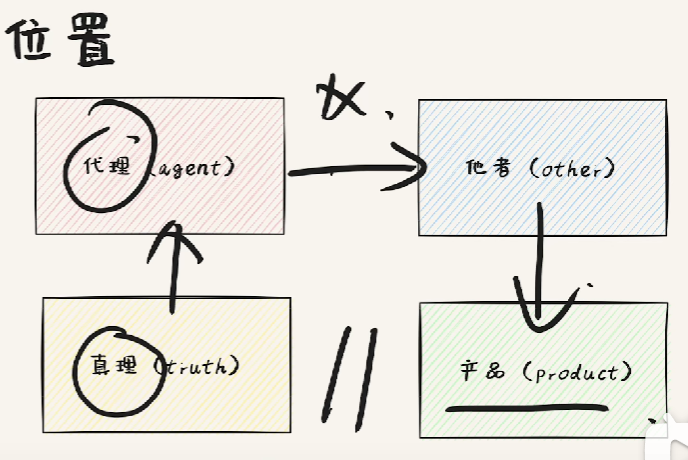
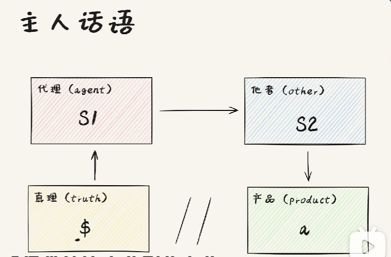
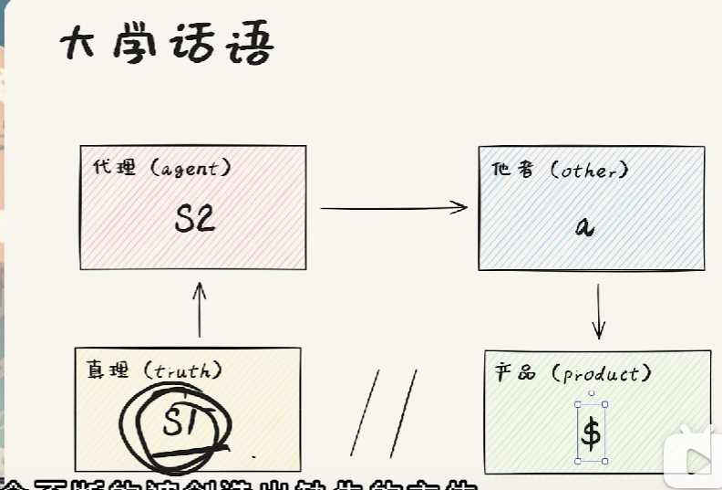
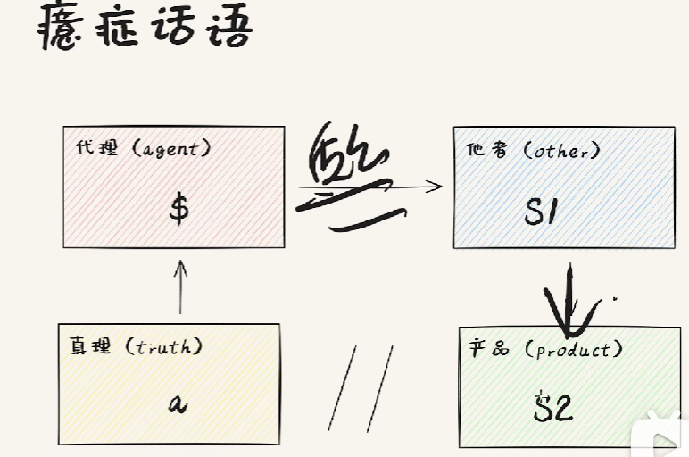
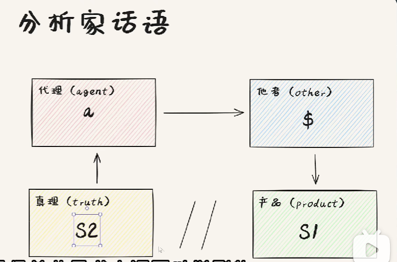

# 四种话语

## 四概念
- 代理: 是谁在说
- 真理: 代理背后的主人
- 他者: 代理言说的对象
- 产品: 代理代理真理向他者演说后,产生的效果
> 狗主人(真理) 让 狗(代理) 咬了你(他者), 你流血(产品)了

## 四角色
- S1 主人能指
- S2 知识
- $ 分裂的主体(被阉割的主题)
- a 主体欲望的成因
  
## 基本结构

真理由代理代理言说
代理向他者言说,但是言说总是不充分的
产品由他者产生
因为言说的不充分,产品和真理之间是断裂的

## 主人话语

我($)向宗教(S1)寻求真理,宗教给出圣经(S2),圣经要求人做祷告(a),祷告不能让我获得真理(//).

## 大学话语

政治家为了发展经济, 言说正确的生活(宣传), 唤起他者的欲望, 产生分裂的他者
市长为了发展经济以及增加自己的政绩(S1), 银行房贷(S2), 让打工人贷款买房(a), 拼命工作($)
S2 = 银行贷款方式的可用性 + 娶妻生子,安身立命的思想观念
a = 幸福生活
\$ = 劳动异化

## 癔症话语

这可能是四话语中最正确的话语了
主体受到欲望的启发/折磨, 去质疑主人能指, 主人能指只能给出知识,但是知识不能解释/满足欲望成因

## 分析家话语

这里是我自己解读,举例:分析家用"谜"的知识,为主体解读主体的欲望成因,主体接受自己的真正欲望, 去做欲望真正想做的